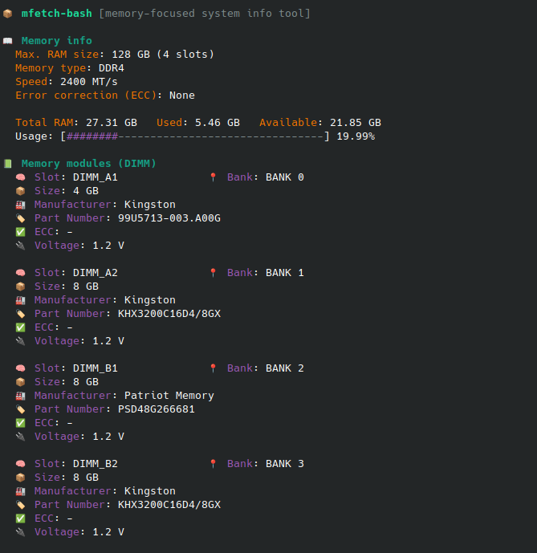

# mfetch-bash

A simple Bash script to display information about your system's RAM. It provides an overview of current memory usage as well as the physical properties of the installed memory modules.

This script is a Bash reimplementation heavily inspired by the original `mfetch` tool written in Rust by [d3v](https://github.com/xdearboy/mfetch).

## Usage

```bash
curl -s https://raw.githubusercontent.com/martyd420/mfetch-bash/master/mfetch.sh | sudo bash
```

<<<<<<< HEAD
### Screenshot



## Key Features

-   **Current Memory Usage:** Displays total, used, and available RAM with a graphical usage bar.
-   **Swap Usage:** If swap is in use, it shows its total size, used space, and free space.
-   **Memory Array Info:** Shows the maximum supported RAM capacity and the total number of memory slots on the motherboard.
-   **Detailed Module Information:** For each installed memory module (DIMM), it lists:
    -   Location (Slot & Bank)
    -   Size (e.g., 8 GB)
    -   Type and Speed (e.g., DDR4, 3200 MT/s)
    -   ECC (Error Correction) Support
    -   Configured Voltage

## Requirements

1.  **Root privileges:** The script requires `sudo` to access hardware information via `dmidecode`.
2.  **The `dmidecode` command:** A utility to read DMI (Desktop Management Interface) tables.
3.  **The `bc` command:** An arbitrary precision calculator, used for floating-point calculations.

If you are missing any of these tools, you can install them using your distribution's package manager:

-   **On Debian/Ubuntu:**
    ```bash
    sudo apt-get update
    sudo apt-get install dmidecode bc
    ```
-   **On Fedora/CentOS/RHEL:**
    ```bash
    sudo dnf install dmidecode bc
    ```

=======

>>>>>>> a55657967047d7f3fefb63eed4b02297aea6ce7e
