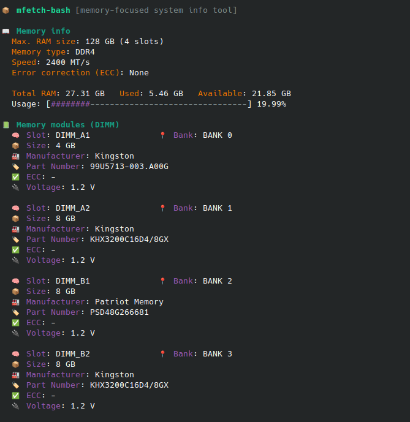

# mfetch-bash

A simple Bash script to display information about your system's RAM. It provides an overview of current memory usage as well as the physical properties of the installed memory modules.

This script is a Bash reimplementation heavily inspired by the original `mfetch` tool written in Rust by [d3v](https://github.com/xdearboy/mfetch).

## Usage

```bash
curl -s https://raw.githubusercontent.com/martyd420/mfetch-bash/master/mfetch.sh | sudo bash
```

Running without `sudo` keeps the oneliner simple, but the script will skip DIMM details because `dmidecode` requires elevated
privileges:

```bash
curl -s https://raw.githubusercontent.com/martyd420/mfetch-bash/master/mfetch.sh | bash
```

To use a specific, immutable (but old) commit, you can specify the commit SHA directly. This ensures the script you download is exactly what you've reviewed and will never change.

```bash
curl -s https://raw.githubusercontent.com/martyd420/mfetch-bash/4ee713f9378c76070f3c2d0ba11fabf454dfd8f9/mfetch.sh | sudo bash
```

### Options

| Option | Description |
| --- | --- |
| `-p`, `--processes N` | List the top `N` memory-consuming process groups (see [Top processes](#top-processes-by-memory)) |
| `--no-color` | Disable colored output (the [`NO_COLOR`](https://no-color.org) environment variable is honored too) |
| `-h`, `--help` | Show help and exit |
| `-V`, `--version` | Show version and exit |

Colors are also disabled automatically when the output is not a terminal (e.g. when piping to a file).

### Screenshot



## Key Features

-   **Current Memory Usage:** Displays total, used, and available RAM with a graphical usage bar.
-   **Swap Usage:** If swap is in use, it shows its total size, used space, and free space.
-   **Memory Array Info:** Shows the maximum supported RAM capacity, the total number of memory slots on the motherboard, the supported memory type, and ECC (Error Correction) support.
-   **Detailed Module Information:** For each installed memory module (DIMM), it lists:
    -   Location (Slot & Bank)
    -   Size (e.g., 8 GB)
    -   Type and Speed (e.g., DDR4, 3200 MT/s), including the configured (actual) speed
    -   Configured Voltage
-   **Top processes by memory:** With `-p N` it groups running processes by name (so all `apache2` workers or `php-fpm` children collapse into a single entry), sums their memory, and lists the `N` heaviest groups.

### Top processes by memory

The `-p`/`--processes N` option adds a section that ranks process groups by the
memory they consume together. Processes are grouped by their name, so for
example ten Apache workers or five PHP-FPM children show up as one line with a
combined total and a process count:

```bash
sudo ./mfetch.sh -p 5
```

As a oneliner, pass the option through `bash -s --` so it reaches the script
instead of `bash` itself (`-s` reads the script from stdin, `--` ends bash's own
options):

```bash
curl -s https://raw.githubusercontent.com/martyd420/mfetch-bash/master/mfetch.sh | sudo bash -s -- -p 5
```

Memory is measured as **PSS** (proportional set size) read from
`/proc/<pid>/smaps_rollup`, which counts shared pages only once — important when
summing many workers that share the same libraries. When PSS is unavailable
(kernels older than 4.14, or another user's processes when run without root) it
falls back to **RSS**. Run with `sudo` for accurate accounting across all users.

## Requirements

1.  **Root privileges (recommended):** Running with `sudo` enables access to hardware information via `dmidecode`. Without root you will still see RAM and swap usage, but DIMM details are omitted.
2.  **The `dmidecode` command:** A utility to read DMI (Desktop Management Interface) tables.

If you are missing `dmidecode`, you can install it using your distribution's package manager:

-   **On Debian/Ubuntu:**
    ```bash
    sudo apt-get update
    sudo apt-get install dmidecode
    ```
-   **On Fedora/CentOS/RHEL:**
    ```bash
    sudo dnf install dmidecode
    ```
