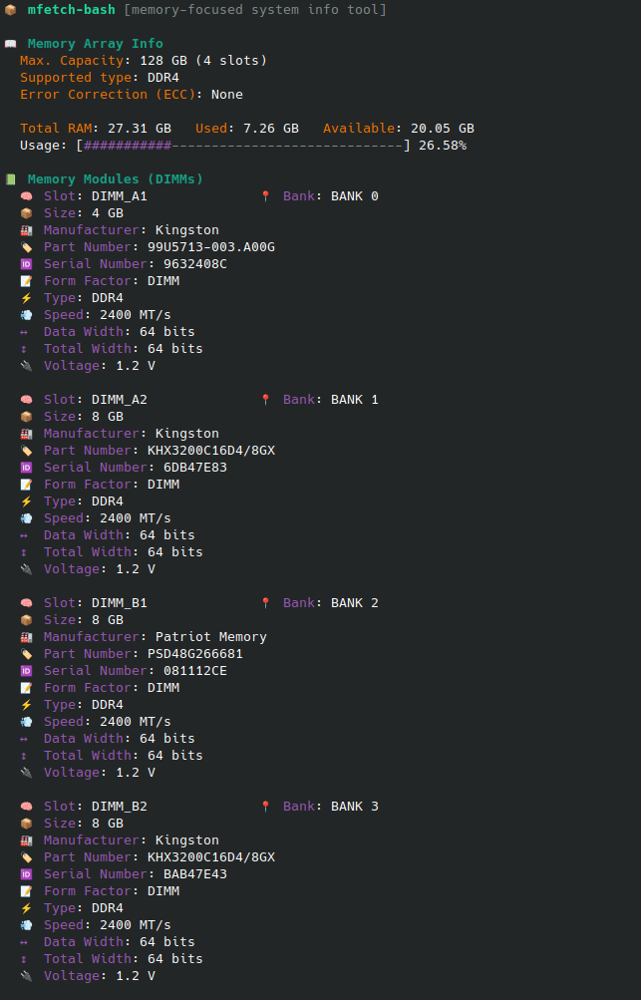

An AI-generated Bash version of a memory-focused system info tool originally written in Rust by d3v (https://github.com/xdearboy/mfetch).

⚠️ This script requires root privileges.

Usage: 

```bash
curl -s https://raw.githubusercontent.com/martyd420/mfetch-bash/master/mfetch.sh | sudo bash
```


